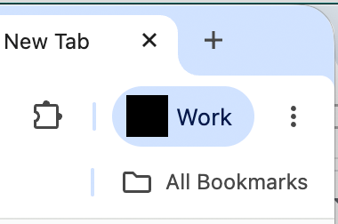

chrome-force-remove-profile-badge-macos
=======================================

In 2025, Google Chrome added what it calls an enterprise profile badge next to
the avatar in the toolbar for profiles signed in with Google Workspace accounts.

The badge reads “Work” in English, and is localised, causing it to be even wider
in other languages.

English:

French:

The avatar alone is enough to distinguish which profile the window belongs to,
meaning the enterprise badge is not only redundant, but also steals an offensive
amount of horizontal space from the toolbar.

During the badge’s introduction, a chrome://flags existed to turn it off, but
this was quickly removed and the badge forcefully activated. Fortunately, the
badge can still be removed by setting the
[EnterpriseProfileBadgeToolbarSettings] enterprise policy to `1`.

Enterprise policies can be configured locally by OS administrators. On Windows,
this is [done in the Windows Registry][Windows Registry]. On Mac OS,
machine-local policies are set using a plist file stored in `/Library/Managed
Preferences/<username>/com.google.Chrome.plist`.

To remove the badge, we can write the plist into the correct location. For
organisations that do not configure this file via their MDM, the file does get
removed automatically when managed preferences are synchronised with the Cloud
MDM server. From late 2025 to summer 2026, I typically only needed to set the
plist file on startup. In late summer 2026, however, I noticed that Chrome was
reactivating the badge much more frequently than before at runtime.

The frequent badge reactivation at runtime prompted this project, a daemon that
starts a file system event listener on the “Managed Preferences” directory and
writes the policy plist whenever it disappears, effectively restoring it.

[EnterpriseProfileBadgeToolbarSettings]: https://chromeenterprise.google/policies/enterprise-profile-badge-toolbar-settings/
[Windows Registry]: https://support.google.com/chrome/a/answer/9131254

## Usage
The program can be run manually:

    $ sudo ./chrome-force-remove-profile-badge-macos

To have it run in the background without user intervention, install a launchd
plist.

The program works by writing a Google Chrome policy plist to `/Library/Managed
Preferences/<username>/com.google.Chrome.plist`, and as such must be run as an
administrator.

## Install
The program can be installed with Homebrew:

	$ brew install teddywing/formulae/chrome-force-remove-profile-badge-macos

## Build

    $ make

## License
Copyright © 2026 Teddy Wing. Licensed under the GNU GPLv3+ (see the included
COPYING file).
